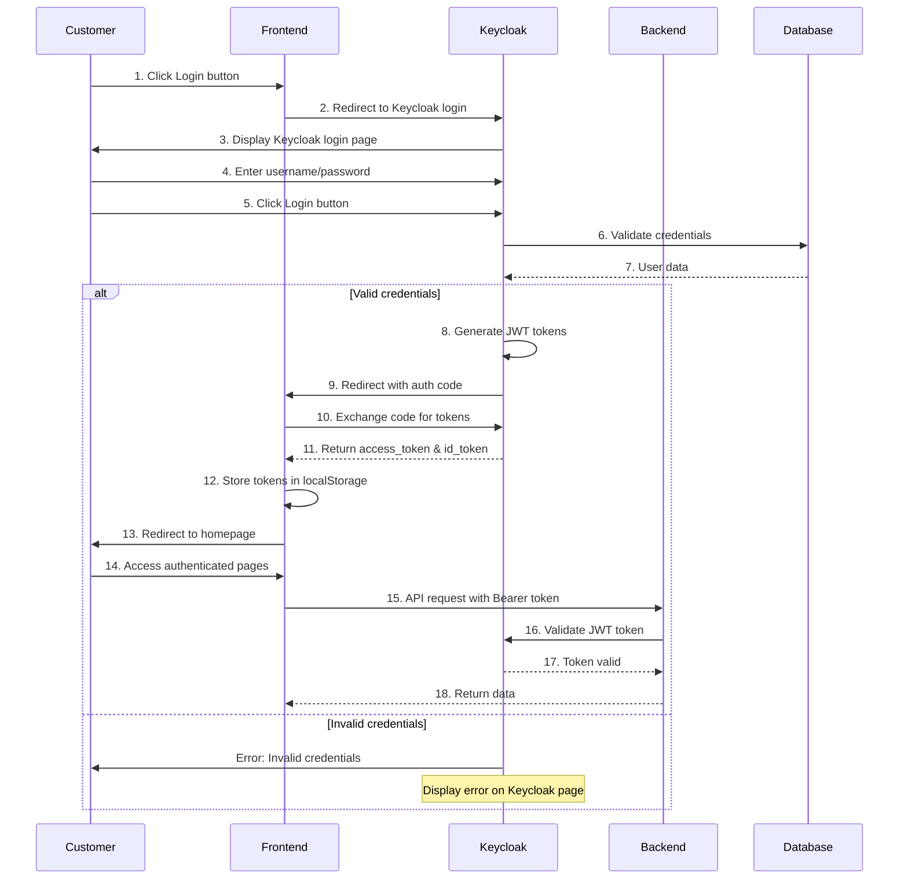
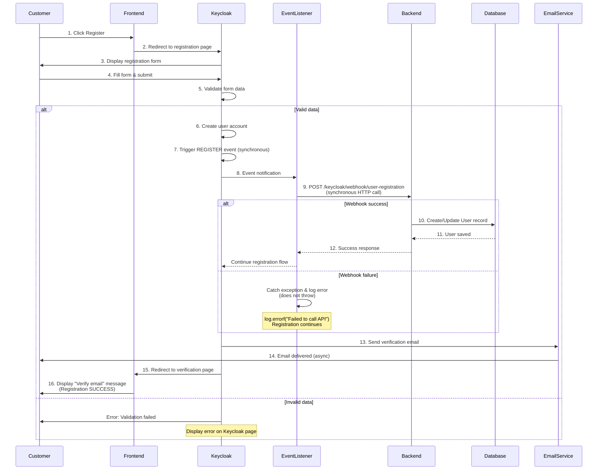
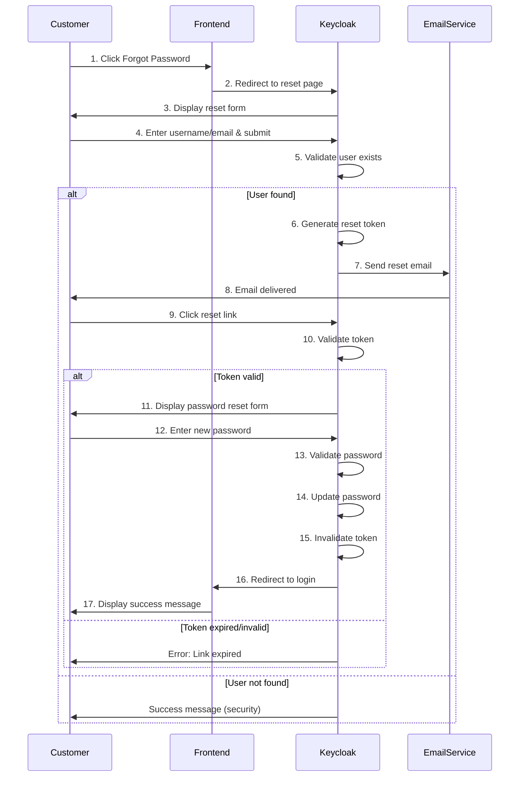
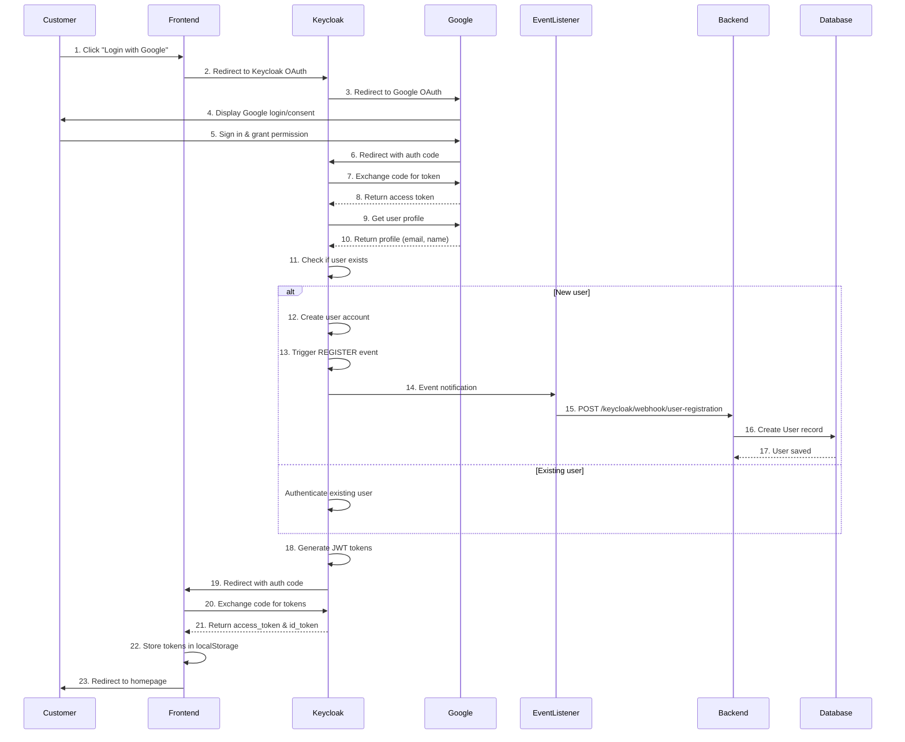

# Use Cases - Authentication System

Tài liệu này mô tả các Use Cases cho hệ thống xác thực của Shoes Shopping Online System, bao gồm Swimlane Diagrams và
Functional Requirements.

---

## UC-01: User Login

### Functional Requirement

| **Field**             | **Content**                                                                                                                                                                                                                                                                                                                                                                                                                                                                                                                                                                                                                                                                    |
|-----------------------|--------------------------------------------------------------------------------------------------------------------------------------------------------------------------------------------------------------------------------------------------------------------------------------------------------------------------------------------------------------------------------------------------------------------------------------------------------------------------------------------------------------------------------------------------------------------------------------------------------------------------------------------------------------------------------|
| **ID and Name**       | UC-01 User Login                                                                                                                                                                                                                                                                                                                                                                                                                                                                                                                                                                                                                                                               |
| **Created By**        | System Analyst                                                                                                                                                                                                                                                                                                                                                                                                                                                                                                                                                                                                                                                                 |
| **Date Created**      | 26/01/2026                                                                                                                                                                                                                                                                                                                                                                                                                                                                                                                                                                                                                                                                     |
| **Primary Actor**     | Customer                                                                                                                                                                                                                                                                                                                                                                                                                                                                                                                                                                                                                                                                       |
| **Secondary Actors**  | Frontend Application, Keycloak, Backend API                                                                                                                                                                                                                                                                                                                                                                                                                                                                                                                                                                                                                                    |
| **Description**       | This use case allows the Customer to authenticate and access the system using username/email and password credentials.                                                                                                                                                                                                                                                                                                                                                                                                                                                                                                                                                         |
| **Trigger**           | Customer clicks Login button on the application homepage.                                                                                                                                                                                                                                                                                                                                                                                                                                                                                                                                                                                                                      |
| **Preconditions**     | PRE-1: Customer has a registered account in the system. PRE-2: Frontend application is accessible. PRE-3: Keycloak authentication server is running.                                                                                                                                                                                                                                                                                                                                                                                                                                                                                                                     |
| **Postconditions**    | POST-1: Customer is authenticated and redirected to the application. POST-2: JWT access token is stored in browser localStorage. POST-3: User session is established.                                                                                                                                                                                                                                                                                                                                                                                                                                                                                                    |
| **Normal Flow**       | 1. Customer clicks "Login" button on the application homepage. 2. Frontend redirects Customer to Keycloak login page. 3. Customer enters username/email and password on Keycloak login page. 4. Customer clicks "Login" button on Keycloak page. 5. Keycloak validates credentials against user database. 6. Keycloak generates JWT access token and ID token. 7. Keycloak redirects to Frontend callback URL with authorization code. 8. Frontend exchanges authorization code for tokens. 9. Frontend stores tokens in localStorage. 10. Frontend redirects Customer to the application homepage. 11. System displays authenticated user menu. |
| **Alternative Flows** | **A1: Invalid Credentials** 4a. Customer enters incorrect username or password on Keycloak page. 4b. Keycloak returns authentication error. 4c. Keycloak displays error message "Invalid username or password" on login page. 4d. Use case resumes at step 3.  **A2: Account Locked** 5a. Keycloak detects account is locked/temporarily disabled. 5b. Keycloak returns account locked error. 5c. Keycloak displays error message "Account is temporarily locked". 5d. Use case ends.                                                                                                                                                            |
| **Exceptions**        | **E1: Keycloak Server Unavailable** 5a. Keycloak server is down or unreachable. 5b. Frontend displays error message "Authentication service is temporarily unavailable". 5c. Use case ends.  **E2: Network Error** 7a. Network connection fails during token exchange. 7b. Frontend displays error message "Network error. Please try again". 7c. Use case resumes at step 1.                                                                                                                                                                                                                                                                          |
| **Priority**          | High                                                                                                                                                                                                                                                                                                                                                                                                                                                                                                                                                                                                                                                                           |
| **Business Rules**    | BR-1: Password must meet complexity requirements (min 8 characters, uppercase, lowercase, number). BR-2: Failed login attempts are logged for security monitoring. BR-3: JWT token expires after 5 minutes, refresh token expires after 30 days.                                                                                                                                                                                                                                                                                                                                                                                                                         |

### Swimlane Diagram

---

## UC-02: User Registration

### Functional Requirement

| **Field**             | **Content**                                                                                                                                                                                                                                                                                                                                                                                                                                                                                                                                                                                                                                                                                                                                                                                                                                                                                                                                                                                                                                                                                                                                                                                                                                                                                                                                                                                                                          |
|-----------------------|--------------------------------------------------------------------------------------------------------------------------------------------------------------------------------------------------------------------------------------------------------------------------------------------------------------------------------------------------------------------------------------------------------------------------------------------------------------------------------------------------------------------------------------------------------------------------------------------------------------------------------------------------------------------------------------------------------------------------------------------------------------------------------------------------------------------------------------------------------------------------------------------------------------------------------------------------------------------------------------------------------------------------------------------------------------------------------------------------------------------------------------------------------------------------------------------------------------------------------------------------------------------------------------------------------------------------------------------------------------------------------------------------------------------------------------|
| **ID and Name**       | UC-02 User Registration                                                                                                                                                                                                                                                                                                                                                                                                                                                                                                                                                                                                                                                                                                                                                                                                                                                                                                                                                                                                                                                                                                                                                                                                                                                                                                                                                                                                              |
| **Created By**        | System Analyst                                                                                                                                                                                                                                                                                                                                                                                                                                                                                                                                                                                                                                                                                                                                                                                                                                                                                                                                                                                                                                                                                                                                                                                                                                                                                                                                                                                                                       |
| **Date Created**      | 26/01/2026                                                                                                                                                                                                                                                                                                                                                                                                                                                                                                                                                                                                                                                                                                                                                                                                                                                                                                                                                                                                                                                                                                                                                                                                                                                                                                                                                                                                                           |
| **Primary Actor**     | Customer                                                                                                                                                                                                                                                                                                                                                                                                                                                                                                                                                                                                                                                                                                                                                                                                                                                                                                                                                                                                                                                                                                                                                                                                                                                                                                                                                                                                                             |
| **Secondary Actors**  | Frontend Application, Keycloak, Backend API, Email Service                                                                                                                                                                                                                                                                                                                                                                                                                                                                                                                                                                                                                                                                                                                                                                                                                                                                                                                                                                                                                                                                                                                                                                                                                                                                                                                                                                           |
| **Description**       | This use case allows a new Customer to create an account in the system by providing personal information and credentials.                                                                                                                                                                                                                                                                                                                                                                                                                                                                                                                                                                                                                                                                                                                                                                                                                                                                                                                                                                                                                                                                                                                                                                                                                                                                                                            |
| **Trigger**           | Customer clicks "Register" or "Sign Up" link on the login page.                                                                                                                                                                                                                                                                                                                                                                                                                                                                                                                                                                                                                                                                                                                                                                                                                                                                                                                                                                                                                                                                                                                                                                                                                                                                                                                                                                      |
| **Preconditions**     | PRE-1: Customer does not have an existing account. PRE-2: Frontend application is accessible. PRE-3: Keycloak authentication server is running.                                                                                                                                                                                                                                                                                                                                                                                                                                                                                                                                                                                                                                                                                                                                                                                                                                                                                                                                                                                                                                                                                                                                                                                                                                                                                |
| **Postconditions**    | POST-1: New user account is created in Keycloak. POST-2: Verification email is sent to Customer's email address. POST-3: Customer is redirected to email verification page (registration successful). POST-4: User record synchronization to Backend database is initiated via webhook (background process).                                                                                                                                                                                                                                                                                                                                                                                                                                                                                                                                                                                                                                                                                                                                                                                                                                                                                                                                                                                                                                                                                                                |
| **Normal Flow**       | 1. Customer clicks "Register" link on login page. 2. Frontend redirects to Keycloak registration page. 3. Customer fills registration form (username, email, password, firstName, lastName). 4. Customer accepts terms and conditions (if required). 5. Customer clicks "Register" button. 6. Keycloak validates form data (email format, password strength, username uniqueness). 7. Keycloak creates new user account. 8. Keycloak triggers REGISTER event (synchronous event handler). 9. Custom Event Listener receives REGISTER event and calls webhook to Backend API (synchronous HTTP call, but failures are caught and logged). 10. Backend API receives user data via webhook and creates/updates User record in database. 11. Keycloak sends email verification email to Customer. 12. Keycloak redirects Customer to email verification info page. 13. Customer sees "Please verify your email" message (registration successful). 14. Customer receives verification email.                                                                                                                                                                                                                                                                                                                                                                                                      |
| **Alternative Flows** | **A1: Email Already Exists** 6a. Keycloak detects email already registered. 6b. Keycloak returns validation error. 6c. Frontend displays error message "Email already exists". 6d. Use case resumes at step 3.  **A2: Username Already Exists** 6a. Keycloak detects username already taken. 6b. Keycloak returns validation error. 6c. Frontend displays error message "Username already taken". 6d. Use case resumes at step 3.  **A3: Weak Password** 6a. Keycloak detects password does not meet requirements. 6b. Keycloak returns validation error. 6c. Frontend displays error message "Password must be at least 8 characters with uppercase, lowercase, and number". 6d. Use case resumes at step 3.                                                                                                                                                                                                                                                                                                                                                                                                                                                                                                                                                                                                                                                                        |
| **Exceptions**        | **E1: Keycloak Server Unavailable** 7a. Keycloak server is down during registration. 7b. Frontend displays error message "Registration service is temporarily unavailable". 7c. Use case ends.  **E2: Webhook Failure** 9a. Backend API webhook endpoint is unavailable, timeout, or returns error status code. 9b. Custom Event Listener catches IOException/RuntimeException in `sendUserData()` method. 9c. Error is logged via `log.errorf("Failed to call API: %s", e)` but exception is NOT re-thrown. 9d. Registration flow continues normally (exception handling prevents webhook failure from affecting registration). 9e. User account is successfully created in Keycloak (registration is successful from Customer perspective). 9f. User record is not synchronized to Backend database. 9g. System administrator is notified via Keycloak logs. 9h. Use case continues normally (Customer sees success message and can verify email). 9i. Backend can retry synchronization later via scheduled job or manual intervention.  **E3: Email Service Failure** 11a. Email service fails to send verification email. 11b. Keycloak logs error. 11c. Keycloak still redirects Customer to verification page. 11d. Customer is informed to contact support if email is not received. 11e. Registration is still considered successful (user account created). |
| **Priority**          | High                                                                                                                                                                                                                                                                                                                                                                                                                                                                                                                                                                                                                                                                                                                                                                                                                                                                                                                                                                                                                                                                                                                                                                                                                                                                                                                                                                                                                                 |
| **Business Rules**    | BR-1: Email address must be unique in the system. BR-2: Username must be unique and between 3-20 characters. BR-3: Password must meet complexity requirements. BR-4: Email verification is required before account activation. BR-5: Registration success is determined by Keycloak user creation, not webhook completion. BR-6: Webhook call is made synchronously in the REGISTER event handler, but exceptions are caught and logged without affecting registration flow. BR-7: Webhook failures are logged via Keycloak logs but do not prevent user from completing registration flow. BR-8: If webhook is slow, it may delay Keycloak response, but if webhook fails, registration still succeeds.                                                                                                                                                                                                                                                                                                                                                                                                                                                                                                                                                                                                                                                                                                        |

### Swimlane Diagram

---

## UC-03: Forgot Password

### Functional Requirement

| **Field**             | **Content**                                                                                                                                                                                                                                                                                                                                                                                                                                                                                                                                                                                                                                                                                                                                                                                                                                                                                                                                               |
|-----------------------|-----------------------------------------------------------------------------------------------------------------------------------------------------------------------------------------------------------------------------------------------------------------------------------------------------------------------------------------------------------------------------------------------------------------------------------------------------------------------------------------------------------------------------------------------------------------------------------------------------------------------------------------------------------------------------------------------------------------------------------------------------------------------------------------------------------------------------------------------------------------------------------------------------------------------------------------------------------|
| **ID and Name**       | UC-03 Forgot Password                                                                                                                                                                                                                                                                                                                                                                                                                                                                                                                                                                                                                                                                                                                                                                                                                                                                                                                                     |
| **Created By**        | System Analyst                                                                                                                                                                                                                                                                                                                                                                                                                                                                                                                                                                                                                                                                                                                                                                                                                                                                                                                                            |
| **Date Created**      | 26/01/2026                                                                                                                                                                                                                                                                                                                                                                                                                                                                                                                                                                                                                                                                                                                                                                                                                                                                                                                                                |
| **Primary Actor**     | Customer                                                                                                                                                                                                                                                                                                                                                                                                                                                                                                                                                                                                                                                                                                                                                                                                                                                                                                                                                  |
| **Secondary Actors**  | Frontend Application, Keycloak, Email Service                                                                                                                                                                                                                                                                                                                                                                                                                                                                                                                                                                                                                                                                                                                                                                                                                                                                                                             |
| **Description**       | This use case allows Customer to reset their password by requesting a password reset link via email.                                                                                                                                                                                                                                                                                                                                                                                                                                                                                                                                                                                                                                                                                                                                                                                                                                                      |
| **Trigger**           | Customer clicks "Forgot Password" link on the login page.                                                                                                                                                                                                                                                                                                                                                                                                                                                                                                                                                                                                                                                                                                                                                                                                                                                                                                 |
| **Preconditions**     | PRE-1: Customer has a registered account. PRE-2: Customer knows their registered email address or username. PRE-3: Email service is configured and operational.                                                                                                                                                                                                                                                                                                                                                                                                                                                                                                                                                                                                                                                                                                                                                                                     |
| **Postconditions**    | POST-1: Password reset email is sent to Customer's registered email. POST-2: Password reset link is generated with expiration time. POST-3: Customer can access password reset page via link.                                                                                                                                                                                                                                                                                                                                                                                                                                                                                                                                                                                                                                                                                                                                                       |
| **Normal Flow**       | 1. Customer clicks "Forgot Password" link on login page. 2. Frontend redirects to Keycloak password reset page. 3. Customer enters username or email address. 4. Customer clicks "Submit" button. 5. Keycloak validates username/email exists in system. 6. Keycloak generates password reset token with expiration (e.g., 1 hour). 7. Keycloak sends password reset email with reset link. 8. Email service delivers email to Customer. 9. Customer receives email and clicks reset link. 10. Keycloak validates reset token (checks expiration and validity). 11. Keycloak displays password reset form. 12. Customer enters new password and confirms. 13. Keycloak validates new password meets requirements. 14. Keycloak updates user password. 15. Keycloak invalidates reset token. 16. Keycloak redirects Customer to login page with success message. 17. Customer can login with new password. |
| **Alternative Flows** | **A1: Username/Email Not Found** 5a. Keycloak cannot find user with provided username/email. 5b. Keycloak still displays success message (security: prevent user enumeration). 5c. No email is sent. 5d. Use case ends.  **A2: Reset Link Expired** 10a. Customer clicks reset link after expiration time. 10b. Keycloak detects expired token. 10c. Keycloak displays error "Reset link has expired". 10d. Keycloak provides option to request new reset link. 10e. Use case resumes at step 1.  **A3: Weak New Password** 13a. New password does not meet requirements. 13b. Keycloak returns validation error. 13c. Frontend displays error message. 13d. Use case resumes at step 12.                                                                                                                                                                                                              |
| **Exceptions**        | **E1: Email Service Failure** 7a. Email service fails to send reset email. 7b. Keycloak logs error. 7c. Customer is informed to contact support or try again later. 7d. Use case ends.  **E2: Invalid Reset Token** 10a. Reset token is invalid or already used. 10b. Keycloak displays error "Invalid reset link". 10c. Customer must request new reset link. 10d. Use case resumes at step 1.                                                                                                                                                                                                                                                                                                                                                                                                                                                                                                                             |
| **Priority**          | High                                                                                                                                                                                                                                                                                                                                                                                                                                                                                                                                                                                                                                                                                                                                                                                                                                                                                                                                                      |
| **Business Rules**    | BR-1: Password reset link expires after 1 hour. BR-2: Reset token can only be used once. BR-3: For security, system does not reveal if email/username exists. BR-4: New password must meet complexity requirements. BR-5: Password reset attempts are logged for security monitoring.                                                                                                                                                                                                                                                                                                                                                                                                                                                                                                                                                                                                                                                         |

### Swimlane Diagram

---

## UC-04: Login with Google

### Functional Requirement

| **Field**             | **Content**                                                                                                                                                                                                                                                                                                                                                                                                                                                                                                                                                                                                                                                                                                                                                                                                                                                                                                                                                                                                                                                                                                                                                                                                                                                                                                            |
|-----------------------|------------------------------------------------------------------------------------------------------------------------------------------------------------------------------------------------------------------------------------------------------------------------------------------------------------------------------------------------------------------------------------------------------------------------------------------------------------------------------------------------------------------------------------------------------------------------------------------------------------------------------------------------------------------------------------------------------------------------------------------------------------------------------------------------------------------------------------------------------------------------------------------------------------------------------------------------------------------------------------------------------------------------------------------------------------------------------------------------------------------------------------------------------------------------------------------------------------------------------------------------------------------------------------------------------------------------|
| **ID and Name**       | UC-04 Login with Google                                                                                                                                                                                                                                                                                                                                                                                                                                                                                                                                                                                                                                                                                                                                                                                                                                                                                                                                                                                                                                                                                                                                                                                                                                                                                                |
| **Created By**        | System Analyst                                                                                                                                                                                                                                                                                                                                                                                                                                                                                                                                                                                                                                                                                                                                                                                                                                                                                                                                                                                                                                                                                                                                                                                                                                                                                                         |
| **Date Created**      | 26/01/2026                                                                                                                                                                                                                                                                                                                                                                                                                                                                                                                                                                                                                                                                                                                                                                                                                                                                                                                                                                                                                                                                                                                                                                                                                                                                                                             |
| **Primary Actor**     | Customer                                                                                                                                                                                                                                                                                                                                                                                                                                                                                                                                                                                                                                                                                                                                                                                                                                                                                                                                                                                                                                                                                                                                                                                                                                                                                                               |
| **Secondary Actors**  | Frontend Application, Keycloak, Google OAuth Service, Backend API                                                                                                                                                                                                                                                                                                                                                                                                                                                                                                                                                                                                                                                                                                                                                                                                                                                                                                                                                                                                                                                                                                                                                                                                                                                      |
| **Description**       | This use case allows Customer to authenticate using their Google account through OAuth2/OIDC protocol without entering username and password.                                                                                                                                                                                                                                                                                                                                                                                                                                                                                                                                                                                                                                                                                                                                                                                                                                                                                                                                                                                                                                                                                                                                                                          |
| **Trigger**           | Customer clicks "Login with Google" button on the login page.                                                                                                                                                                                                                                                                                                                                                                                                                                                                                                                                                                                                                                                                                                                                                                                                                                                                                                                                                                                                                                                                                                                                                                                                                                                          |
| **Preconditions**     | PRE-1: Customer has a Google account. PRE-2: Google Identity Provider is configured in Keycloak. PRE-3: Frontend application is accessible.                                                                                                                                                                                                                                                                                                                                                                                                                                                                                                                                                                                                                                                                                                                                                                                                                                                                                                                                                                                                                                                                                                                                                                      |
| **Postconditions**    | POST-1: Customer is authenticated via Google account. POST-2: If new user, account is created in Keycloak and Backend database. POST-3: JWT access token is stored in browser localStorage. POST-4: Customer is redirected to the application.                                                                                                                                                                                                                                                                                                                                                                                                                                                                                                                                                                                                                                                                                                                                                                                                                                                                                                                                                                                                                                                                |
| **Normal Flow**       | 1. Customer clicks "Login with Google" button on login page. 2. Frontend redirects to Keycloak OAuth endpoint. 3. Keycloak redirects Customer to Google OAuth consent screen. 4. Customer signs in with Google credentials (if not already signed in). 5. Customer grants permission to application (if first time). 6. Google redirects back to Keycloak with authorization code. 7. Keycloak exchanges authorization code for Google access token. 8. Keycloak retrieves user profile from Google (email, name, etc.). 9. Keycloak checks if user exists in Keycloak database. 10. If user exists: Keycloak authenticates user. 11. If user does not exist: Keycloak creates new user account with Google profile data. 12. Keycloak triggers REGISTER event (if new user). 13. Custom Event Listener sends webhook to Backend API (if new user). 14. Backend API creates User record in database (if new user). 15. Keycloak generates JWT access token and ID token. 16. Keycloak redirects to Frontend callback URL with authorization code. 17. Frontend exchanges authorization code for tokens. 18. Frontend stores tokens in localStorage. 19. Frontend redirects Customer to the application homepage. 20. System displays authenticated user menu. |
| **Alternative Flows** | **A1: User Denies Permission** 5a. Customer denies permission to access Google account. 5b. Google redirects back with error. 5c. Keycloak displays error message. 5d. Frontend redirects Customer back to login page. 5e. Use case ends.  **A2: Google Account Not Verified** 8a. Google account email is not verified. 8b. Keycloak may reject or require email verification. 8c. Customer is informed to verify Google email first. 8d. Use case ends.  **A3: Existing User with Different Email** 9a. Google email matches existing Keycloak user email. 9b. Keycloak links Google identity to existing account. 9c. Customer is authenticated successfully. 9d. Use case continues at step 15.                                                                                                                                                                                                                                                                                                                                                                                                                                                                                                                                                                 |
| **Exceptions**        | **E1: Google OAuth Service Unavailable** 3a. Google OAuth service is down or unreachable. 3b. Keycloak displays error "Google authentication service unavailable". 3c. Customer is redirected back to login page. 3d. Use case ends.  **E2: Keycloak Google Configuration Error** 7a. Keycloak Google Identity Provider configuration is incorrect. 7b. Token exchange fails. 7c. Keycloak logs error. 7d. Customer sees generic error message. 7e. Use case ends.  **E3: Webhook Failure (New User)** 13a. Backend API webhook endpoint is unavailable for new user. 13b. Keycloak logs error but continues authentication. 13c. User account is created in Keycloak but not in Backend database. 13d. System administrator is notified. 13e. Use case continues (user can still access application).                                                                                                                                                                                                                                                                                                                                                                                                                                                           |
| **Priority**          | High                                                                                                                                                                                                                                                                                                                                                                                                                                                                                                                                                                                                                                                                                                                                                                                                                                                                                                                                                                                                                                                                                                                                                                                                                                                                                                                   |
| **Business Rules**    | BR-1: Google Identity Provider must be configured in Keycloak with valid Client ID and Secret. BR-2: First-time Google login automatically creates user account. BR-3: User data from Google (email, firstName, lastName) is synchronized to Backend via webhook. BR-4: Google email is used as the primary identifier for the account. BR-5: Customer can link multiple identity providers to the same account.                                                                                                                                                                                                                                                                                                                                                                                                                                                                                                                                                                                                                                                                                                                                                                                                                                                                                           |

### Swimlane Diagram

---

## Summary

### Actors Involved

- **Customer**: End user interacting with the system
- **Frontend Application**: React-based web application
- **Keycloak**: Identity and Access Management server
- **Backend API**: Spring Boot REST API
- **Database**: PostgreSQL database
- **Email Service**: Email delivery service
- **Google**: Google OAuth2 service
- **Custom Event Listener**: Keycloak extension for webhook notifications

### Key Technologies

- **OAuth2/OIDC**: Authentication protocol
- **JWT**: Token-based authentication
- **Webhook**: Event-driven user synchronization
- **React OIDC Context**: Frontend authentication library
- **Spring Security**: Backend security framework

### Common Patterns

1. **Token-based Authentication**: All use cases use JWT tokens for stateless authentication
2. **Webhook Synchronization**: User registration triggers webhook to sync data to Backend database
3. **Redirect Flow**: OAuth2 authorization code flow with redirects
4. **Error Handling**: Comprehensive error handling at each step
5. **Security**: Password complexity, token expiration, account locking
